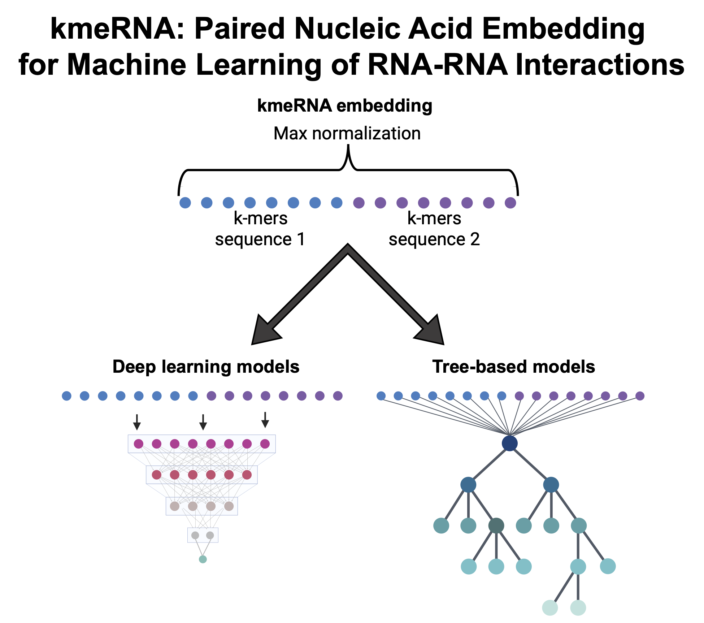

#
<h1 style="text-align: center;"> 
<a href="https://github.com/ouyang-lab/kmeRNA-pipeline" >kmeRNA Pipeline</a>
</h1>
<div align="center">

</div>

## Introduction
The kmeRNA embedding strategy is a straightforward processing step that takes a list of nucleic acid sequence pairs. In general, we describe the traditional double-negative model (negative samples have negative sequences) and the mixed-negative model (query-target), which is organized such that the first sequence (query) and second sequence (target) are each of the consistent type of RNA involved in the interaction. For example, to predict which RNA transcripts bind to a particular miRNA, the query would be the miRNA and the target would consist of true and false target sequences. See [Pederson <i>et al.</i> 2025](https://www.doi.org/) for more details. The kmeRNA pipeline has been tested using eRNA-paRNA & miRNA-lncRNA in eukaryotes and sRNA-mRNA data in prokaryotes (See Resources section).
We include a full pipeline for training, testing and validating RNA-RNA interaction models for deep learning and tree-based models with optional feature importance analysis either through scikit-learn (Gini index) tree-based models or differential SHAP scores. 
Note: while untested, we expect kmeRNA to be compatible with RNA-DNA and DNA-DNA interaction datasets as well.


## Installation
### Embedding only
For instructions on how to run the embedding step only, refer to the Embedding step below. Output files can be saved as `.csv` or `.pkl` formats for portability.
The following is required for standalone kmeRNA embedding step:
* `Python 3.9+`
* `NumPy 2.0+`

### Full install with conda
The following packages are required for the full kmeRNA pipeline:
* `Python 3.9+`
* `numpy 2.0+`
* `scipy`
* `scikit-learn`
* `pandas`
* `matplotlib`
* `tensorflow`
* `keras 3`
* `joblib`
* `biopython`
* `shap`
* `bedtools`
* `samtools`

### CPU install
First, create the environment using the `kmeRNA_environment.yml` file and activate the environment: <br />
`conda env create -f kmeRNA_environment.yml` <br />
`conda activate kmeRNA_pipeline_env`

### GPU install
GPU-aware Keras and TensorFlow installation is machine-dependent. Please refer to [The TensorFlow GPU](https://www.tensorflow.org/guide/gpu) and [the Keras GPU](https://keras.io/getting_started/) instructions for details.  

## Code

### Example Code & Data
An example driver script is available in `example_scripts/` with relative paths to the example data in `kmeRNA_eRNA-paRNA_RICseq_example_data/`. 
Follow instructions at the top of `example_scripts/example_kmeRNA_script.sh` to run kmeRNA on a ~70%-15%-15% data split of HeLa eRNA-paRNA RIC-seq data, which was used in the original kmeRNA publication. Output models and results files can be found in `kmeRNA_eRNA-paRNA_RICseq_example_data/split_train/results`, `kmeRNA_eRNA-paRNA_RICseq_example_data/split_test/results` and `kmeRNA_eRNA-paRNA_RICseq_example_data/split_validate/results`. 

Continue to the next sections if applying kmeRNA to your own dataset and further explanation of each script.

### Embedding
#### Input file formatting:
RNA-RNA interactions files require 3 columns and any extra columns are ignored:

**For double-negative models (traditional classification task):**
1. The first column must contain the unique sequence/pair ID and if the full pipeline is being used, any negative pairs should have a "\_neg" as the suffix if using `src/00_extract_labels.sh`.
2. The second column is a sequence. Positive samples should be a consistent RNA type (i.e. eRNA, miRNA) throughout the dataset. Negative sequences should be paired with another negative sequence  in the third column.
3. The third column is a sequence. Positive samples should be a consistent RNA type (i.e. paRNA, lncRNA) throughout the dataset. Negative sequences should be paired with another negative sequence  in the second column.

**For mixed-negative models (query-target classification task):**
1. The first column must contain the unique sequence/pair ID and if the full pipeline is being used, any negative pairs should have a "\_neg" as the suffix if using `src/00_extract_labels.sh`.
2. The second column is the query sequence. Positive samples should be a consistent RNA type (i.e. eRNA, miRNA) throughout the dataset. Do not include negative sequences in this position.
3. The third column is the target sequence. Positive samples should be a consistent RNA type (i.e. paRNA, lncRNA) throughout the dataset. Add negative sequences in this column to generate negative samples.

```sh
sh src/00_extract_labels.sh \
    --input_data /path/to/data \ # input training, testing or validation with "_neg" ID suffixes
    --labels /path/to/data_labels.txt # training, testing or validation labels
```
The label generating step with `src/00_extract_labels.sh` can be skipped if you have already generated a text file with appropriate class assignments (0 or 1).
```sh

python src/01_kmer_feature_counts.py \
    --input /path/to/input/file.tsv.gz \ # It is recommended that files are gzipped 
    --output /path/to/output/file.tsv.gz \ # It is recommended that files are gzipped
    --out_format ['csv','pkl','csv,pkl'] \ # specifies the output format as either csv, pkl or both.
    --min_k 1 \ # Minimum k-mer size (int)
    --max_k 5 \ # Maximum k-mer size (int)
    --verbose
```
### Deep learning
```sh
python src/02_train_test_kmer_keras.py \
    --train_data /path/to/training_data.pkl \
    --train_labels /path/to/training_data_labels.txt \
    --test_data /path/to/testing_data.pkl \ # Optional data for validation split
    --test_labels /path/to/testing_data_labels.txt \ # Required if --test_data is provided
    --model_out /path/to/output_model_prefix \ # Appends '.keras' to end of path name
    --model_in /path/to/input_model_prefix \ # Used when loading a pre-trained model to make predictions. Exclude '.keras' file extension
    --seed_val 12345 \ # Seed control for reproducibility
    --output_train_prob /path/to/training_data_predictions \ # Output training data predictions
    --output_test_prob /path/to/testing_data_predictions \ # Output for testing data predictions
    --plot_path /path/to/output_plot_prefix \ # For generating plots 
    --batch_size 48 \ # Batch size (int) for each training step. 
    --task ["RNA-RNA","miRNA-RNA","sRNA-mRNA"] \ # Which default batch_size to use. Defaults to RNA-RNA with batch_size=48. This can be overridden using --batch_size. 
    --max_epochs 20 \ # Number (int) of times to iterate through the training data
    --min_k 1 \ # Minimum k-mer size (int)
    --max_k 5 \ # Maximum k-mer size (int)
    --drop1 4 \ # Number (float) of nodes to drop out between 1st and 2nd dense layers 
    --drop2 3 \ # Number (float) of nodes to drop out between 2nd and 3rd dense layers
    --drop3 2 \ # Number (float) of nodes to drop out between 3rd and 4th dense layers
    --drop4 1 \ # Number (float) of nodes to drop out between 4th and 5th dense layers
    --cv \ # Use with --test_data and --test_labels when using a validation dataset to control early stopping
    --save_best_epochs # Saves the best epochs to file based on loss or val_loss (with --cv)
```
### Tree-based methods
```sh
python src/03_train_test_kmer_ensemble.py \
    --train_data /path/to/training_data.pkl \
    --train_labels /path/to/training_data_labels.txt \
    --test_data /path/to/testing_data.pkl \ # Optional data for validation split
    --test_labels /path/to/testing_data_labels.txt \ # Required if --test_data is provided
    --model_out /path/to/output_model_prefix \ # Appends '[RF|ET|GB].joblib' to end of path name
    --model_in /path/to/input_model_prefix \ # Used when loading a pre-trained model to make predictions. Exclude '[RF|ET|GB].joblib' file extension
    --seed_val 12345 \ # Seed control for reproducibility
    --output_train_prob /path/to/training_data_predictions \ # Output training data predictions
    --output_test_prob /path/to/testing_data_predictions \ # Output for testing data predictions
    --min_k 1 \ # Minimum k-mer size (int)
    --max_k 5 # Maximum k-mer size (int)
 
```
### Feature importance
```sh
python src/04_get_SHAP_diff_values.py \
    --model /path/to/input_model \
    --data /path/to/training_data.pkl \
    --output /path/to/SHAP_feature_importance.tsv \
    --min_k 1 \ # Minimum k-mer size (int)
    --max_k 5 \ # Maximum k-mer size (int)
    --sample_size 1000 \ # number (int) of randomly selected training examples to use for SHAP
    --bg_sample_size 100 \ # number (int) of randomly selected traning examples to use as background for SHAP
    --tree # If the input model is tree-based
```
## Generating eRNA-paRNA RIC-seq negative samples
A series of auxiliary scripts are available under the `E-P_RICseq` folder in order to download the datasets, calculate appropriate splitting, generate the random regions for use in the rest of the pipeline. Adjust absolute paths prior to running.

## Resources
### eRNA-paRNA data
[Enhancer-Promoter RIC-seq](https://www.ncbi.nlm.nih.gov/geo/query/acc.cgi?acc=GSE190214)
### miRNA-lncRNA data
[lncRNASNP2](https://guolab.wchscu.cn/lncRNASNP/#!/)
### sRNA-mRNA data
[sRNA-mRNA](https://zenodo.org/records/14590335)

# Copyright and License
This project is licensed under the [MIT License](./LICENSE).
See the [COPYRIGHT](./COPYRIGHT) file for details.
